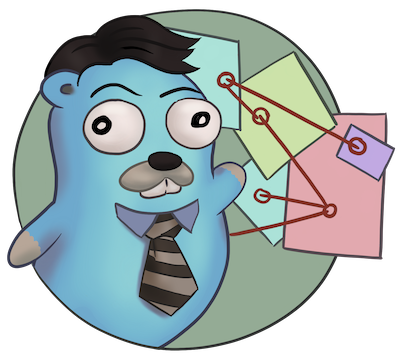

# errtrace

<div align="center">



</div>


- [Introduction](#introduction)
  - [Features](#features)
  - [Try it out](#try-it-out)
  - [Why is this useful](#why-is-this-useful)
- [Installation](#installation)
- [Usage](#usage)
  - [Manual instrumentation](#manual-instrumentation)
  - [Automatic instrumentation](#automatic-instrumentation)
- [Performance](#performance)
- [Caveats](#caveats)
  - [Error wrapping](#error-wrapping)
  - [Safety](#safety)
- [Contributing](#contributing)
- [Acknowledgements](#acknowledgements)
- [License](#license)

## Introduction

errtrace is extremely experimental.
Use it at your own risk.

errtrace is an experimental package to trace an error’s return path --
the return trace -- through a Go program.

Where a stack trace tracks the code path that led to an error,
a return trace tracks the code path that the error took to get to the user.
Often these are the same path, but in Go they can diverge,
since errors are values that can be transported across goroutines
(e.g. with channels).
When that happens, a return trace can be more useful than a stack trace.

This library is inspired by
[Zig’s error return traces](https://ziglang.org/documentation/0.11.0/#Error-Return-Traces).

### Features

* **Lightweight**\
  errtrace brings no other runtime dependencies with it.
* **[Simple](#manual-instrumentation)**\
  The library API is simple, straightforward, and idiomatic.
* **[Easy](#automatic-instrumentation)**\
  The errtrace CLI will automatically instrument your code.
* **[Fast](#performance)**\
  On popular 64-bit systems,
  errtrace is much faster than capturing a stack trace.

### Try it out

Try out errtrace with your own code:

1. Install the CLI.

   ```bash
   go install braces.dev/errtrace/cmd/errtrace@latest
   ```
2. Switch to your Git repository and instrument your code.

   ```bash
   git ls-files -- '*.go' | xargs errtrace -w
   ```
3. Let `go mod tidy` install the errtrace Go module for you.

   ```bash
   go mod tidy
   ```
4. Run your tests to ensure everything still works.
  You may see failures
  if you’re comparing errors with `==` on critical paths
  or if you’re type-casting errors directly.
  See [Error wrapping](#error-wrapping) for more details.

   ```bash
   go test ./...
   ```
5. Print return traces for errors in your code.
  To do this, you can use the `errtrace.FormatString` function
  or format the error with `%+v` in `fmt.Printf`-style functions.

   ```go
   if err != nil {
     fmt.Fprintf(os.Stderr, "%+v", err)
   }
   ```

Return traces printed by errtrace
will include the error message
and the path the error took until it was printed.
The output will look roughly like this:

```
error message

example.com/myproject.MyFunc
	/home/user/myproject/myfile.go:123
example.com/myproject.CallerOfMyFunc
	/home/user/myproject/another_file.go:456
[...]
```

Some real world examples of errtrace in action:

<details>
<summary>Example 1</summary>

```
doc2go: parse file: /path/to/project/example/foo.go:3:1: expected declaration, found invalid

go.abhg.dev/doc2go/internal/gosrc.parseFiles
        /path/to/project/internal/gosrc/parser.go:85
go.abhg.dev/doc2go/internal/gosrc.(*Parser).ParsePackage
        /path/to/project/internal/gosrc/parser.go:44
main.(*Generator).renderPackage
        /path/to/project/generate.go:193
main.(*Generator).renderTree
        /path/to/project/generate.go:141
main.(*Generator).renderTrees
        /path/to/project/generate.go:118
main.(*Generator).renderPackageIndex
        /path/to/project/generate.go:149
main.(*Generator).renderTree
        /path/to/project/generate.go:137
main.(*Generator).renderTrees
        /path/to/project/generate.go:118
main.(*Generator).renderPackageIndex
        /path/to/project/generate.go:149
main.(*Generator).renderTree
        /path/to/project/generate.go:137
main.(*Generator).renderTrees
        /path/to/project/generate.go:118
main.(*Generator).Generate
        /path/to/project/generate.go:110
main.(*mainCmd).run
        /path/to/project/main.go:199
```

Note the some functions repeat in this trace
because the functions are mutually recursive.
</details>

<details open>
<summary>Example 2</summary>

Realistic comparison of a
stacktrace versus an error return trace
for a custom dial error from the HTTP client,
which happens on a background goroutine.

<table>
<thead>
<tr><td>errtrace</td><td>stacktrace</td></tr>
</thead>
<tbody>

<tr><td>

```
Error: connect rate limited

braces.dev/errtrace_test.rateLimitDialer
	/path/to/errtrace/example_http_test.go:72
braces.dev/errtrace_test.(*PackageStore).updateIndex
	/path/to/errtrace/example_http_test.go:59
braces.dev/errtrace_test.(*PackageStore).Get
	/path/to/errtrace/example_http_test.go:49
```

</td><td>

```
Error: connect rate limited
braces.dev/errtrace_test.rateLimitDialer
	/errtrace/example_stack_test.go:81
net/http.(*Transport).dial
	/goroot/src/net/http/transport.go:1190
net/http.(*Transport).dialConn
	/goroot/src/net/http/transport.go:1625
net/http.(*Transport).dialConnFor
	/goroot/src/net/http/transport.go:1467
runtime.goexit
	/goroot/src/runtime/asm_arm64.s:1197
```

</td></tr>
<tr>
<td>errtrace reports the method that triggered the HTTP request</td>
<td>stacktrace shows details of how the HTTP client creates a connection</td>
</tr>
</tbody>
</table>

</details>

### Why is this useful?

In Go, [errors are values](https://go.dev/blog/errors-are-values).
This means that an error can be passed around like any other value.
You can store it in a struct, pass it through a channel, etc.
This level of flexibility is great,
but it can also make it difficult to track down the source of an error.
A stack trace stored in an error -- recorded at the error site --
becomes less useful as the error moves through the program.
When it’s eventually surfaced to the user,
we’ve lost a lot of context about its origin.

With errtrace,
we instead record the path the program took from the error site
to get to the user -- the **return trace**.
Not only can this be more useful than a stack trace,
it tends to be much faster and more lightweight as well.

## Installation

Install errtrace with Go modules:

```bash
go get braces.dev/errtrace@latest
```

If you want to use the CLI, use `go install`.

```bash
go install braces.dev/errtrace/cmd/errtrace@latest
```

## Usage

errtrace offers the following modes of usage:

* [Manual instrumentation](#manual-instrumentation)
* [Automatic instrumentation](#automatic-instrumentation)

### Manual instrumentation

```go
import "braces.dev/errtrace"
```

Under manual instrumentation,
you’re expected to import errtrace,
and wrap errors at all return sites like so:

```go
// ...
if err != nil {
    return errtrace.Wrap(err)
}
```

<details>
<summary>Example</summary>

Given a function like the following:

```go
func writeToFile(path string, src io.Reader) error {
  dst, err := os.Create(path)
  if err != nil {
    return err
  }
  defer dst.Close()

  if _, err := io.Copy(dst, src); err != nil {
    return err
  }

  return nil
}
```

With errtrace, you’d change it to:

```go
func writeToFile(path string, src io.Reader) error {
  dst, err := os.Create(path)
  if err != nil {
    return errtrace.Wrap(err)
  }
  defer dst.Close()

  if _, err := io.Copy(dst, src); err != nil {
    return errtrace.Wrap(err)
  }

  return nil
}
```

It’s important that the `errtrace.Wrap` function is called
inside the same function that’s actually returning the error.
A helper function will not suffice.
</details>

### Automatic instrumentation

If manual instrumentation is too much work (we agree),
we’ve included a tool that will automatically instrument
all your code with errtrace.

First, [install the tool](#installation).
Then, run it on your code:

```bash
errtrace -w path/to/file.go path/to/another/file.go
```

To run it on all Go files in your project,
if you use Git, run the following command on a Unix-like system:

```bash
git ls-files -- '*.go' | xargs errtrace -w
```

errtrace can be set be setup as a custom formatter in your editor,
similar to gofmt or goimports.

## Performance

errtrace is designed to have very low overhead
on [supported systems](#supported-systems).

Benchmark results for linux/amd64 on an Intel Core i5-13600 (best of 10):

```
BenchmarkFmtErrorf      11574928               103.5 ns/op            40 B/op          2 allocs/op
# default build, uses Go assembly.
BenchmarkWrap           78173496                14.70 ns/op           24 B/op          0 allocs/op
# build with -tags safe to avoid assembly.
BenchmarkWrap            5958579               198.5 ns/op            24 B/op          0 allocs/op

# benchext compares capturing stacks using pkg/errors vs errtrace
# both tests capture ~10 frames,
BenchmarkErrtrace        6388651               188.4 ns/op           280 B/op          1 allocs/op
BenchmarkPkgErrors       1673145               716.8 ns/op           304 B/op          3 allocs/op
```

Stack traces have a large initial cost,
while errtrace scales with each frame that an error is returned through.

## Caveats

### Error wrapping

errtrace operates by wrapping your errors to add caller information.
As a result of this,
error comparisons and type-casting may not work as expected.
You can no longer use `==` to compare errors, or type-cast them directly.
You must use the standard library’s
[errors.Is](https://pkg.go.dev/errors#Is) and
[errors.As](https://pkg.go.dev/errors#As) functions.

For example, if you have a function `readFile`
that wraps an `io.EOF` error with errtrace:

**Matching errors**

```go
err := readFile() // returns errtrace.Wrap(io.EOF)

// This will not work.
fmt.Println(err == io.EOF)          // false

// Use errors.Is instead.
fmt.Println(errors.Is(err, io.EOF)) // true
```

Similarly, if you have a function `runCmd`
that wraps an `exec.ExitError` error with errtrace:

**Type-casting errors**

```go
err := runCmd() // returns errtrace.Wrap(&exec.ExitError{...})

// This will not work.
exitErr, ok := err.(*exec.ExitError) // ok = false

// Use errors.As instead.
var exitErr *exec.ExitError
ok := errors.As(err, &exitErr)       // ok = true
```

#### Linting

You can use [go-errorlint](https://github.com/polyfloyd/go-errorlint)
to find places in your code
where you’re comparing errors with `==` instead of using `errors.Is`
or type-casting them directly instead of using `errors.As`.

### Safety

To achieve the performance above on [supported systems](#supported-systems),
errtrace makes use of unsafe operations using Go assembly
to read the caller information directly from the stack.
This is part of the reason why we have the disclaimer on top.

errtrace includes an opt-in safe mode
that drops these unsafe operations in exchange for poorer performance.
To opt into safe mode,
use the `safe` build tag when compiling code that uses errtrace.

```bash
go build -tags safe
```

#### Supported systems

errtrace’s unsafe operations are currently implemented
for `GOARCH=amd64` and `GOARCH=arm64` only.
Other systems are supported but they will use safe mode, which is slower.

Contributions to support unsafe mode for other architectures are welcome.

## Contributing

Contributions are welcome.
However, we ask that before contributing new features,
you [open an issue](https://github.com/bracesdev/errtrace/issues)
to discuss the feature with us.

## Acknowledgements

The idea of tracing return paths instead of stack traces
comes from [Zig’s error return traces](https://ziglang.org/documentation/0.11.0/#Error-Return-Traces).

## License

This software is made available under the BSD3 license.
See LICENSE file for details.
