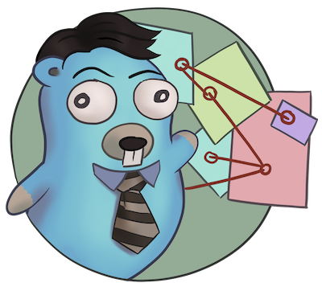

# Introduction

  

> **Warning**:
> errtrace is extremely experimental.
> Use it at your own risk.

errtrace is an experimental package to trace an error's return path
through a Go program.

Rather than providing a stack trace
showing the *inwards* route that caused an error,
errtrace lets you track the *outwards* route that the error took
until you ultimately handle it.
We believe that this can be more useful than a plain stack trace
for complex programs written in Go.

## Features

- **Lightweight**:
  errtrace brings no other runtime dependencies with it.
- [**Simple**](instrument-manual.md):
  The library API is simple, straightforward, and idiomatic.
- [**Automatic**](instrument-auto.md):
  The errtrace CLI will automatically instrument your code.
- [**Fast**](performance.md):
  On popular 64-bit systems, errtrace is much faster
  than capturing a stack trace.

## Why

In languages like Go where errors are values,
users have the ability to store the error in a struct,
pass it through a channel, etc.

This can result in a situation where a stack trace,
which records the path *to the error*,
loses some usefulness as it moves through the program
before it's surfaced to the user.

We believe that for such programs,
it can be more useful and more performant
to have the return trace instead:
the path the error took *out* to get to the user.

This library is an experiment to evaluate that idea.

